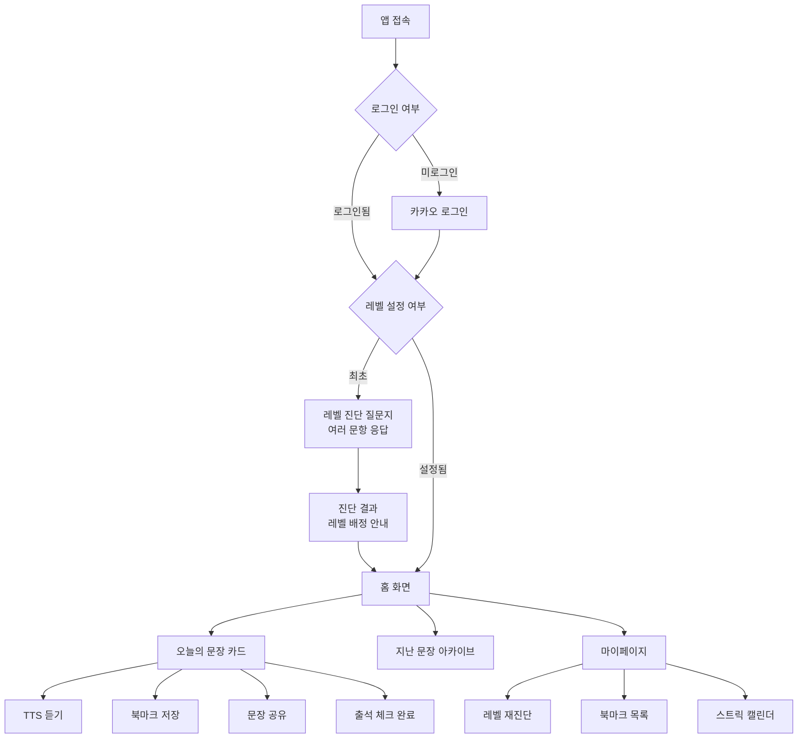
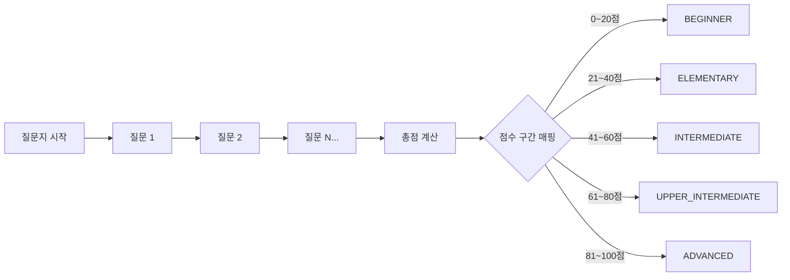
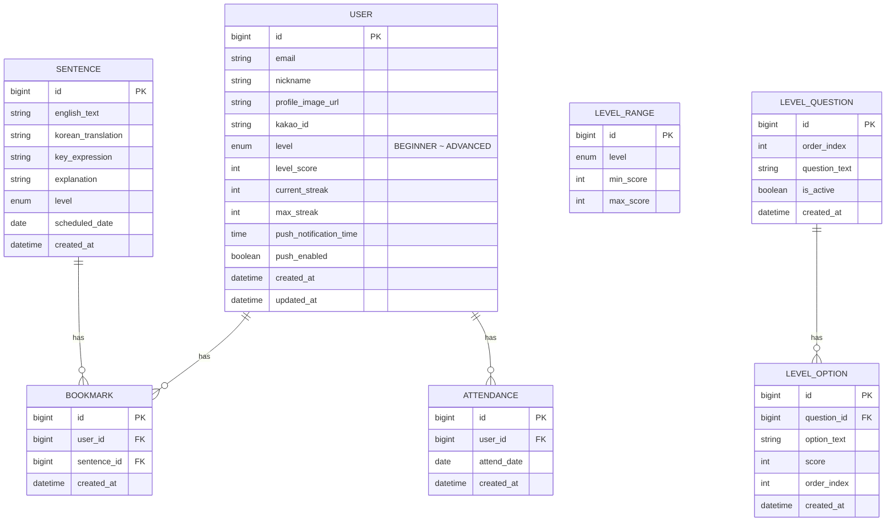

# OneSentence - 수준별 영어 문장 데일리 웹앱

## 1. 업무스펙 (Business Spec)

### 1-1. 서비스 개요

- **서비스명**: OneSentence
- **핵심 가치**: 매일 1개의 영어 문장을 사용자 수준에 맞게 제공하여 꾸준한 영어 학습 습관 형성
- **타겟 사용자**: 매일 짧은 시간으로 영어를 학습하고 싶은 한국어 사용자
- **플랫폼**: 웹앱 (PWA) -> 추후 네이티브 앱 래핑 (인앱토스 결제 확장)

### 1-2. 사용자 여정 (User Flow)



### 1-3. 핵심 기능 상세

- **소셜 로그인**: 카카오 로그인 SDK 연동 (1차). 추후 토스 로그인 확장. JWT 기반 세션 관리
- **레벨 진단 질문지**: 최초 가입 시 질문지 기반으로 레벨 자동 배정. 운영자가 질문과 선택지를 등록/관리. 각 선택지에 점수를 부여하여 총점 기반으로 5단계 레벨 매핑. 마이페이지에서 재진단 가능
- **레벨 시스템**: 5단계 (BEGINNER / ELEMENTARY / INTERMEDIATE / UPPER_INTERMEDIATE / ADVANCED)
- **오늘의 문장**: 매일 00:00 KST 기준 새로운 문장 갱신. 레벨별 1개씩 총 5개 문장 준비. 영문 + 한글 번역 + 핵심 단어/표현 해설 포함
- **TTS (Text-to-Speech)**: Web Speech API 활용 (무료). 영문 문장 음성 재생. 속도 조절 (0.5x / 0.75x / 1.0x)
- **북마크**: 마음에 드는 문장 저장. 북마크 목록에서 다시 보기/TTS 재생 가능
- **출석 스트릭**: 매일 오늘의 문장을 확인하면 출석 체크. 연속 출석일 카운트 및 캘린더 뷰. 최장 연속 기록 표시
- **문장 공유**: 카카오톡/인스타 스토리/링크 복사로 공유. 문장 카드 이미지 형태로 공유 가능
- **푸시 알림**: PWA Service Worker 기반 Web Push 알림. 사용자가 설정한 시간에 "오늘의 문장이 도착했어요!" 알림 발송

### 1-4. 레벨 진단 질문지 설계



- **구조**: 질문(Question) -> 선택지(Option) 형태
- **채점**: 각 선택지에 점수(score)를 부여, 전체 응답 점수 합산 -> 레벨 구간 매핑
- **관리**: 운영자가 질문/선택지/점수/레벨 구간을 DB에서 관리
- **예시 질문**: "다음 문장의 빈칸에 알맞은 단어는?", "이 문장의 의미로 가장 적절한 것은?" 등

### 1-5. 콘텐츠 소싱 전략 (외부 데이터셋)

- **1차 소스**: Tatoeba 오픈 데이터셋 (CC 라이선스, 영어-한국어 병렬 문장)
- **2차 소스**: OpenAI API로 난이도 태깅 및 해설 자동 생성 (초기 시딩용 배치)
- **운영 방식**: 초기에 레벨별 최소 365개(1년치) 문장을 시딩한 후, 순차적으로 제공
- **난이도 기준**: CEFR (A1~C1) 매핑 -> 앱 내 5단계 레벨

### 1-6. 데이터 모델 (핵심 엔티티)



### 1-7. 향후 확장 (v2+)

- 토스 로그인 연동
- 인앱토스 결제 연동 (프리미엄 플랜: 해설 상세, 추가 문장, 광고 제거 등)
- 퀴즈/복습 기능
- 레벨 자동 재추천 (학습 패턴 분석)
- 카테고리별 문장 (비즈니스/여행/일상 등)

---

## 2. 테크스펙

### 2-1. Frontend

**스택: Vite + React 18 + TypeScript + Tailwind CSS + Shadcn/UI**

- **Vite + React**
  - 빠른 HMR, 가벼운 빌드 (SPA)
  - React Router로 클라이언트 사이드 라우팅
  - PWA 플러그인(`vite-plugin-pwa`)으로 Service Worker / Web Push 구현
  - 향후 Capacitor 래핑으로 네이티브 앱 배포 가능 (인앱토스 연동 시)
- **Tailwind CSS + Shadcn/UI**
  - 빠른 UI 개발, 모바일 퍼스트 반응형
  - Shadcn/UI 컴포넌트 커스터마이징 용이
- **주요 라이브러리**
  - `react-router-dom` v6: 클라이언트 라우팅
  - `@tanstack/react-query`: 서버 상태 관리 (API 캐싱, 리패칭)
  - `axios`: HTTP 클라이언트
  - `vite-plugin-pwa`: PWA / Service Worker / Push Notification
  - `date-fns`: 날짜 처리 (스트릭, 캘린더)
  - `html-to-image`: 공유 카드 이미지 생성
  - `framer-motion`: 카드 넘김 등 인터랙션 애니메이션
  - `zustand`: 클라이언트 상태 관리 (경량)
- **디렉토리 구조**

```
frontend/
  src/
    pages/
      LoginPage.tsx
      LevelQuizPage.tsx
      LevelResultPage.tsx
      HomePage.tsx
      ArchivePage.tsx
      MyPage.tsx
      BookmarkPage.tsx
    components/
      common/
        Layout.tsx
        BottomNav.tsx
      sentence/
        SentenceCard.tsx
        TtsButton.tsx
        ShareModal.tsx
      level/
        QuizQuestion.tsx
        QuizProgress.tsx
        LevelResult.tsx
      streak/
        StreakCalendar.tsx
        StreakBadge.tsx
    hooks/
      useTts.ts
      useStreak.ts
      useAuth.ts
    api/
      client.ts
      auth.api.ts
      sentence.api.ts
      bookmark.api.ts
      attendance.api.ts
      level.api.ts
    stores/
      authStore.ts
    types/
      index.ts
    App.tsx
    main.tsx
    router.tsx
  public/
    sw.js
  index.html
  vite.config.ts
  tailwind.config.ts
  Dockerfile
```

### 2-2. Backend

**스택: Nest.js + TypeScript + Prisma + PostgreSQL**

- **Nest.js + TypeScript**
  - Frontend와 동일 언어(TypeScript)로 타입 공유 및 개발 생산성 극대화
  - 모듈 기반 구조로 확장성 우수
  - Guards, Interceptors, Pipes 등 인증/검증 미들웨어 체계적
  - Swagger 자동 생성으로 API 문서화 용이
  - 추후 Toss Payments SDK(JS)와 자연스러운 통합
- **Prisma ORM**
  - 타입 안전한 DB 접근
  - 마이그레이션 관리 편리
  - PostgreSQL과 최적 호환
- **PostgreSQL**
  - JSON 타입 지원 (문장 해설 등 유연한 데이터)
  - 날짜/시간 함수 강력 (스트릭 계산, 스케줄링)
- **주요 라이브러리**
  - `@nestjs/passport` + `passport-kakao`: 카카오 소셜 로그인
  - `@nestjs/jwt`: JWT 토큰 관리
  - `@nestjs/schedule`: 크론잡 (매일 문장 스케줄링, 푸시 알림 발송)
  - `web-push`: Web Push 알림 서버
  - `@nestjs/swagger`: API 문서 자동 생성
  - `class-validator` + `class-transformer`: DTO 검증
- **디렉토리 구조**

```
backend/
  src/
    auth/
      auth.module.ts
      auth.controller.ts
      auth.service.ts
      strategies/
        kakao.strategy.ts
      guards/
        jwt-auth.guard.ts
    sentence/
      sentence.module.ts
      sentence.controller.ts
      sentence.service.ts
      sentence.scheduler.ts
    bookmark/
      bookmark.module.ts
      bookmark.controller.ts
      bookmark.service.ts
    attendance/
      attendance.module.ts
      attendance.controller.ts
      attendance.service.ts
    notification/
      notification.module.ts
      notification.service.ts
      notification.scheduler.ts
    user/
      user.module.ts
      user.controller.ts
      user.service.ts
    level/
      level.module.ts
      level.controller.ts
      level.service.ts
    prisma/
      prisma.module.ts
      prisma.service.ts
    common/
      decorators/
      filters/
      interceptors/
    app.module.ts
    main.ts
  prisma/
    schema.prisma
    seed.ts
  Dockerfile
```

### 2-3. 인프라 / 배포

- **Frontend**: Vercel (Vite+React SPA 정적 배포, 무료 티어)
- **Backend**: Railway (Nest.js + PostgreSQL, Dockerfile 기반 배포)
- **DB**: Railway PostgreSQL
- **CI/CD**: GitHub Actions (빌드/테스트/배포 자동화)
- **컨테이너**: Frontend/Backend 각각 Dockerfile 제공

### 2-4. API 설계 (핵심 엔드포인트)

- `POST /auth/kakao` - 카카오 로그인 (인가코드 -> JWT 발급)
- `POST /auth/refresh` - 토큰 갱신
- `GET /level/questions` - 레벨 진단 질문지 조회
- `POST /level/submit` - 질문지 응답 제출 -> 레벨 배정 결과 반환
- `GET /sentences/today` - 오늘의 문장 조회 (사용자 레벨 기반)
- `GET /sentences/archive?page=&size=` - 지난 문장 목록
- `POST /bookmarks/:sentenceId` - 북마크 추가
- `DELETE /bookmarks/:sentenceId` - 북마크 삭제
- `GET /bookmarks` - 북마크 목록 조회
- `POST /attendance` - 출석 체크
- `GET /attendance/streak` - 스트릭 정보 조회
- `GET /attendance/calendar?year=&month=` - 출석 캘린더 조회
- `PATCH /users/me/notification` - 푸시 알림 설정
- `GET /users/me` - 내 정보 조회

---

## 3. 구현 우선순위 (마일스톤)

- **Phase 1 - MVP (2~3주)**
  - 프로젝트 셋업 (Vite+React + Nest.js + Prisma + PostgreSQL + Dockerfile)
  - 카카오 소셜 로그인 + JWT
  - 레벨 진단 질문지 (질문 조회 + 응답 제출 + 레벨 배정)
  - 오늘의 문장 조회 (시드 데이터 기반)
  - TTS 재생
  - 기본 UI (문장 카드, 홈, 로그인, 질문지)
- **Phase 2 - 핵심 기능 (2주)**
  - 북마크 CRUD
  - 출석 스트릭 + 캘린더
  - 문장 아카이브
  - 마이페이지 (레벨 재진단 포함)
- **Phase 3 - 알림/공유 (1~2주)**
  - PWA Service Worker 세팅
  - Web Push 알림 (매일 문장 알림)
  - 문장 카드 이미지 공유 (카카오톡, 링크 복사)
- **Phase 4 - 확장 (추후)**
  - 토스 로그인 연동
  - 인앱토스 결제 연동
  - 퀴즈/복습 기능
  - 콘텐츠 확장 (카테고리별)
